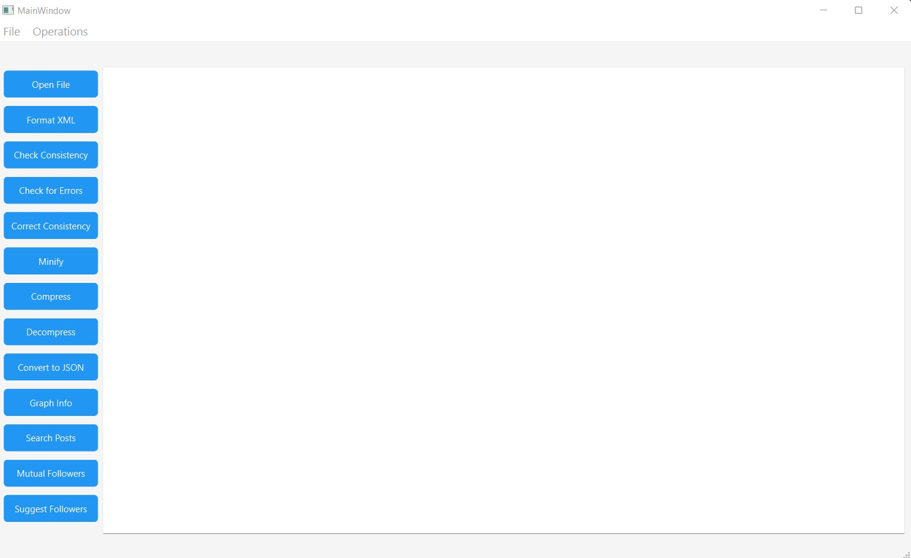
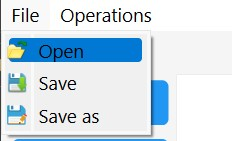
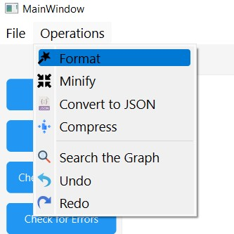

# XML Editor

### This project is a simple XML Editor that runs many operations on an XML File.

You can download the XML Editor from [here](https://drive.google.com/file/d/1BYXo02YTunAQo-e_ypvv8viLTliNOdQl/view?usp=share_link)

This is what the UI of the editor will look like:

# The XML Editor Menubar Tabs
## The File tab:
*Open: You can open either a .xml file or a .txt file.
*Save and Save as: Save can be used to immediately save the changes to the same file the user opened and with the same file extension, Save as will allow the user to save the changes in a new file with any extension.

## The Operations tab:
*Format: This button auto-indents the selected file into the correct indentation. It can be used on any xml-structured files and the output will be a formatted and well-indented file.
*Minify: This button removes all the spaces, indents, and new lines in the file.
*Convert To JSON: This button converts the file from XML format to JSON Format.
*Compress: The output will be a compressed form of the file.
*Search The Graph: This pops which takes an input, this input represents a topic in the xml file that the user is searching for. This will display all the results for all posts about this topic in the given xml file.
*Undo and Redo: Can be used if the user edited something in the file and would like to undo/redo.

## Main Buttons:
*Open File: Opens a .xml or a .txt file.
*Format: Same as the Filetab format button.
*Check Consistency: Can be used to check if the given file is consistent or not.
*Check for Errors: Detects Errors in the file and their type and location.
*Correct Consistency: Corrects any inconsistent XML files.
*Minify: Removes all the white spaces and new lines from the file.
*Compress: Compresses the file.
*Decompress: Decompresses already compressed XML files and puts them in the correct formatted form.
*Graph Info: Analyses the network of the XML file, and prints out its information (Most Active and Most followed user)
*Search Posts: Same as Search the graph button in the Filetab.
*Mutual Followers: The user inputs the IDs of two users in the xml file, the output is the mutual followers between those 2 users.
*Suggest Followers: The user inputs the ID of a user in the xml file, the output is suggested followers for this user.
